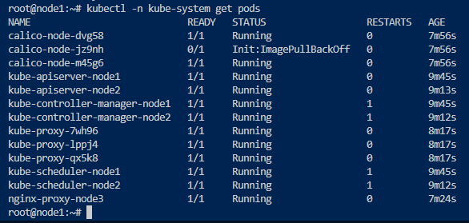
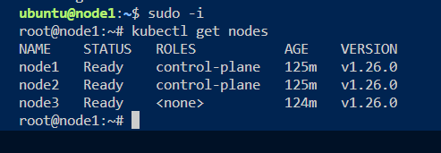

# Kubernetes cluster installation with Kubespray


# Create Project Directory
```
mkdir -p homelab/kubernetes
cd homelab/kubernetes
```


# Clone the kubespray Project
```
git clone https://github.com/kubernetes-sigs/kubespray.git
```


# Install and activate python virtual environment
```
python3 -m venv kubespray-venv
source kubespray-venv/bin/activate
```

# Install ansible 
```
cd kubespray
pip install -U -r requirements-2.12.txt
```
requirements.txt dosyasının içine bakınız. Ansible versionu yanlış yazılmış olabilir.
## NOTE
Ayrıca kubespray/playbooks/ansible_version.yml dosyası içerisinde aşağıdaki kısımda ansible versiyonu 2.14-2.15 yazılmış.Fakat ansible yüklediğinizde 2.13.3 yükleniyor dolayısıyla playbook çalıştırınca hata veriyor kurulumda. Bu minimal değeri 2.13 yapın.
```
vars:
    minimal_ansible_version: 2.14.0
    maximal_ansible_version: 2.15.0
```

# Create hosts inventory
```
declare -a IPS=(172.20.0.21 172.20.0.22 172.20.0.23 172.20.0.24 172.20.0.25)
cd ../ 
mkdir -p cluster/homelab-k8s
CONFIG_FILE=cluster/homelab-k8s/hosts.yaml python3 kubespray/contrib/inventory_builder/inventory.py ${IPS[@]}
```

# Inspect hosts.yaml
```
cat cluster/homelab-k8s/hosts.yaml
```

# Deploy cluster
```
cd kubespray
ansible-playbook -i ../cluster/homelab-k8s/hosts.yaml -e @../cluster/homelab-k8s/cluster-config.yaml --user=debian --become --become-user=root cluster.yaml
```
## Note:
Yukarıdaki playbook çalıştırma komutu hatalı olabilir "...cluster..." kısmı "...clusters..." olabilir. Dikkat..

# Verify deployment
```
ssh debian@172.20.0.21
sudo -i 
kubectl get nodes
kubectl -n kube-system get pods
less /etc/kubernetes/admin.conf 
```



## Note:
* nodelardan biri ilk başta kurulumda hata verdi. Daha sonra ilk kurulumda düzeldi. Kubespray şu an kubernetes v1.26.0 destekliyor. Youtube daki kurulum videosunda v1.25.1 ile kurulum yapılmıştı.


# Upgrade Cluster
```
ansible-playbook -i ../cluster/homelab-k8s/hosts.yaml -e @../cluster/homelab-k8s/cluster-config.yaml --user=debian --become --become-user=root upgrade-cluster.yaml
```

# Scale Down Cluster
```
ansible-playbook -i ../cluster/homelab-k8s/hosts.yaml -e @../cluster/homelab-k8s/cluster-config.yaml --user=debian --become --become-user=root remove-node.yaml -e node=node5
```


# Scale Up cluster
```
ansible-playbook -i ../cluster/homelab-k8s/hosts.yaml -e @../cluster/homelab-k8s/cluster-config.yaml --user=debian --become --become-user=root scale.yaml --limit=node5
```
